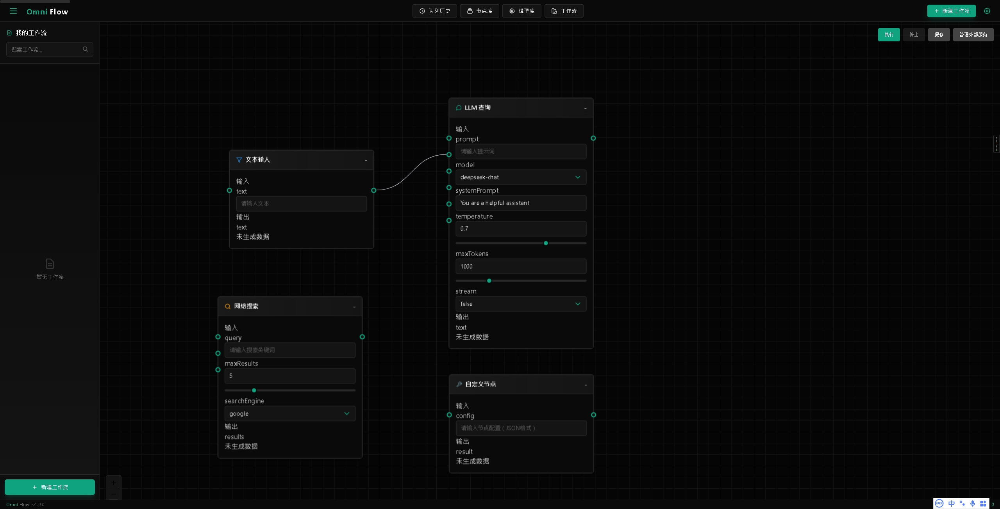

# OmniFlow

OmniFlow 是一款专注于大语言模型应用的可视化工作流编辑器。通过简单的拖拽操作，你就能轻松构建复杂的 AI 工作流，让创意快速落地。

🚧 开发进行中 - DEMO ONLY 🚧

[English](./README.md)




## ✨ 亮点特色

- 🎯 所见即所得的拖拽式编辑器，不写代码也能搭建 AI 应用
- 🎨 精心设计的深色主题，让你专注于创作
- 🔌 丰富的节点类型，满足各类 AI 任务需求
- ⚡ 工作流实时执行，所有操作即时响应
- 🛠️ 模块化设计，轻松扩展新功能
- 🌐 无缝对接主流 AI 服务
- 📊 直观的执行状态展示

## 🔧 技术选型

- **前端框架**: Next.js 14
- **界面组件**: React 18 + TailwindCSS
- **工作流引擎**: React Flow
- **状态管理**: Zustand
- **开发语言**: TypeScript
- **多语言支持**: next-intl

## 🚀 快速上手

### 运行环境

确保你的电脑已安装：
- Node.js（16.0 或更高版本）
- 包管理器（npm 或 yarn）
- Git

### 安装教程

复制下面的命令一键部署：

```bash
# 下载项目
git clone https://github.com/yourusername/OmniFlow.git

# 进入项目目录并安装依赖
cd OmniFlow
npm install

# 启动开发环境
npm run dev
```

启动成功后，打开浏览器访问 `http://localhost:3000` 即可开始使用。

## 📖 使用指南

我们提供了详尽的使用文档，你可以在 [docs](./docs) 目录下找到：
- 快速入门教程
- 功能详解
- 最佳实践
- 常见问题解答

## 🛠️ 开发指南

### 项目结构一览

```
OmniFlow/
├── src/               # 源码目录
│   ├── components/    # React组件
│   ├── services/      # 核心业务逻辑
│   ├── styles/        # 样式文件
│   ├── types/        # 类型定义
│   └── utils/        # 工具函数
├── public/           # 静态资源
└── docs/            # 项目文档
```

### 常用命令

- `npm run dev`: 启动本地开发环境
- `npm run build`: 打包生产版本
- `npm run lint`: 代码规范检查
- `npm test`: 运行测试用例

## ⚠️ 开源协议

本项目采用非商业性使用许可证，详情请查看 [LICENSE](LICENSE) 文件。
特别说明：本项目仅供学习和个人使用，严禁用于商业目的。

## 🤝 参与贡献

我们欢迎各种形式的贡献，无论是新功能、文档改进还是 bug 修复。参与开发前，请先阅读[贡献指南](CONTRIBUTING.md)。

## 📫 联系我们

- 遇到问题？[提交 Issue](https://github.com/yourusername/OmniFlow/issues)
- 想要交流？发送邮件到 ltu46166@gmail.com

## 🙏 特别感谢

项目离不开这些优秀的开源工具：

- [React Flow](https://reactflow.dev/) - 强大的工作流引擎
- [Next.js](https://nextjs.org/) - React 应用开发框架
- [TailwindCSS](https://tailwindcss.com/) - 实用优先的 CSS 框架

> 💡 小贴士
> 
> - 首次使用建议先阅读快速入门教程
> - 遇到问题先看看常见问题解答
> - 有好的想法随时可以提 Issue 讨论
