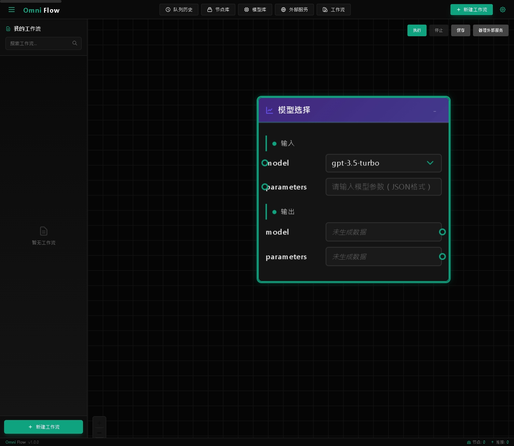

# OmniFlow

OmniFlow 是一个强大的节点式工作流编辑器，专为 LLM (Large Language Model) 应用设计。它提供了一个直观的可视化界面，让用户能够轻松构建和执行复杂的 AI 工作流。


## 界面预览


工作流编辑器提供了直观的可视化界面

## 🌟 主要特性

- 📝 直观的拖放式节点编辑界面
- 🤖 丰富的节点类型，支持各种 AI 任务
- 🔄 实时工作流执行和状态可视化
- 🛠️ 可扩展的节点系统
- 🌐 支持多种外部服务集成
- 🎨 美观的深色主题界面
- 🔌 模块化设计，易于扩展

## 🔧 技术栈

- **框架**: Next.js 14
- **UI 组件**: React 18, TailwindCSS
- **工作流引擎**: React Flow
- **状态管理**: Zustand
- **类型系统**: TypeScript
- **国际化**: next-intl

## ⚡️ 快速开始

### 前置需求

- Node.js 16+
- npm 或 yarn
- Git

### 安装步骤

1. 克隆仓库

```bash
git clone https://github.com/B143KC47/OmniFlow.git
cd OmniFlow
```

2. 安装依赖

```bash
npm install
# 或
yarn install
```

3. 启动开发服务器

```bash
npm run dev
# 或
yarn dev
```

4. 在浏览器中访问 `http://localhost:3000`

## 🎯 核心功能

### 节点类型

- **基础节点**
  - 📝 文本输入：提供文本输入界面
  - 🤖 LLM 查询：连接并调用 LLM 模型
  - 🔍 网络搜索：执行网络信息检索
  - 📚 文档查询：在本地文档中搜索内容

- **高级节点**
  - ⚙️ 编码器：文本向量编码转换
  - 🎲 采样器：从多个选项中采样
  - 🔧 模型选择器：动态选择 LLM 模型
  - 💻 自定义节点：执行自定义 JavaScript 代码

### 工作流功能

- ✨ 实时拖放编辑
- 🔗 智能节点连接
- 💾 自动保存
- ⚡ 实时执行
- 🎨 美观的节点样式
- 📊 执行状态可视化

## 🛠️ 开发指南

### 添加新节点类型

1. 在 `src/components/nodes` 目录下创建新的节点组件
2. 在 `src/types.ts` 中定义节点类型
3. 在 `NodePalette.tsx` 中添加节点到侧边栏
4. 在 `WorkflowEditor.tsx` 中注册节点类型

示例：
```typescript
// 1. 创建节点组件 (src/components/nodes/MyNewNode.tsx)
const MyNewNode = () => {
  // 实现节点逻辑
};

// 2. 添加节点类型 (src/types.ts)
export enum NodeType {
  // ...其他节点类型
  MY_NEW_NODE = 'myNewNode'
}

// 3. 在节点面板中添加 (src/components/NodePalette.tsx)
const nodeCategories = [
  {
    id: 'myCategory',
    name: '我的分类',
    nodes: [
      {
        type: NodeType.MY_NEW_NODE,
        label: '新节点',
        description: '节点描述',
        color: '#someColor',
        icon: '🆕'
      }
    ]
  }
];
```

### MCP (Model Control Panel) 集成

1. 实现 `BaseProvider` 的子类
2. 在 `McpService` 中注册提供者
3. 添加必要的配置界面

## 📝 工作流最佳实践

1. **模块化设计**
   - 将复杂工作流拆分为小型、可重用的部分
   - 使用自定义节点封装常用功能

2. **错误处理**
   - 为关键节点添加错误检查
   - 使用分支处理异常情况

3. **性能优化**
   - 避免创建不必要的连接
   - 合理使用异步节点

## 📜 许可证

ISC License

## 🤝 贡献指南

欢迎提交 Issue 和 Pull Request！在贡献代码前，请确保：

1. 代码符合项目的编码规范
2. 新功能包含适当的测试
3. 文档已经更新
4. Commit 信息清晰明了

## 🙏 致谢

感谢以下开源项目：

- [React Flow](https://reactflow.dev/)
- [Next.js](https://nextjs.org/)
- [TailwindCSS](https://tailwindcss.com/)