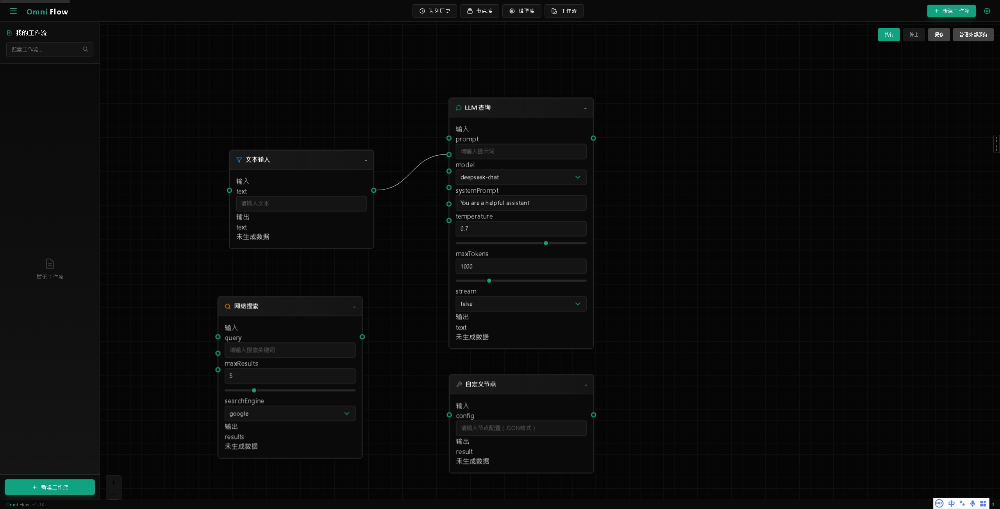
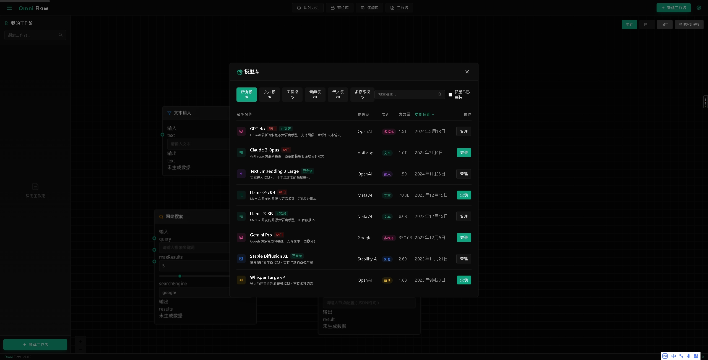
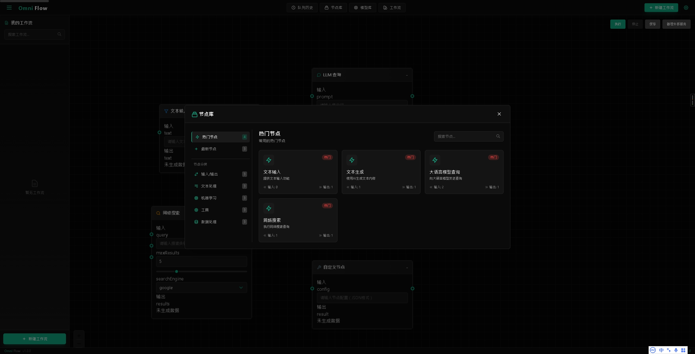
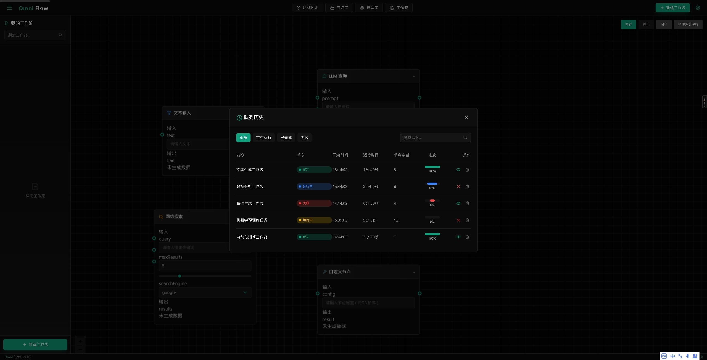

# OmniFlow

An advanced node-based workflow editor designed for LLM (Large Language Model) applications, enabling visual construction and execution of complex AI workflows.
 
🚧 WORK IN PROGRESS - DEMO ONLY 🚧

[中文文档](./README.CN.md)







## ✨ Features

- 📝 Intuitive drag-and-drop node editor
- 🤖 Rich node types for various AI tasks
- 🔄 Real-time workflow execution
- 🔌 Modular design for easy extension
- 🌐 Multi-service integration support
- 🎯 Advanced node routing and control
- 🎨 Beautiful dark-themed UI

## 🔧 Tech Stack

- **Framework**: Next.js 14
- **UI**: React 18, TailwindCSS
- **Workflow Engine**: React Flow
- **State Management**: Zustand
- **Type System**: TypeScript
- **I18n**: next-intl

## 🚀 Getting Started

### Prerequisites

- Node.js 16+
- npm or yarn
- Git

### Installation

```bash
# Clone the repository
git clone https://github.com/yourusername/OmniFlow.git

# Install dependencies
cd OmniFlow
npm install

# Start development server
npm run dev
```

Visit `http://localhost:3000` in your browser.

## 📖 Documentation

Detailed documentation can be found in the [docs](./docs) directory.

## 🛠️ Development

### Project Structure

```
OmniFlow/
├── src/
│   ├── components/    # React components
│   ├── services/     # Business logic services
│   ├── styles/       # Global styles & themes
│   ├── types/        # TypeScript definitions
│   └── utils/        # Utility functions
├── public/           # Static assets
└── docs/            # Documentation
```

### Available Scripts

- `npm run dev`: Start development server
- `npm run build`: Build for production
- `npm run lint`: Run linter
- `npm test`: Run tests

## ⚠️ License

This project is licensed under a Non-Commercial License - see the [LICENSE](LICENSE) file for details.
Commercial use is strictly prohibited.

## 🤝 Contributing

Contributions are welcome! Please read our [Contributing Guide](CONTRIBUTING.md) first.

## 📫 Contact

- Create an issue: [Issue Tracker](https://github.com/B143KC47/OmniFlow/issues)
- Email: ltu46166@gmail.com

## 🙏 Acknowledgments

Thanks to all the open-source projects that made this possible:

- [React Flow](https://reactflow.dev/)
- [Next.js](https://nextjs.org/)
- [TailwindCSS](https://tailwindcss.com/)